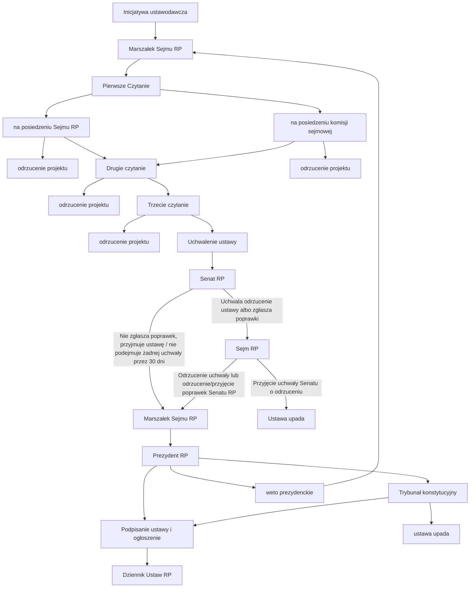
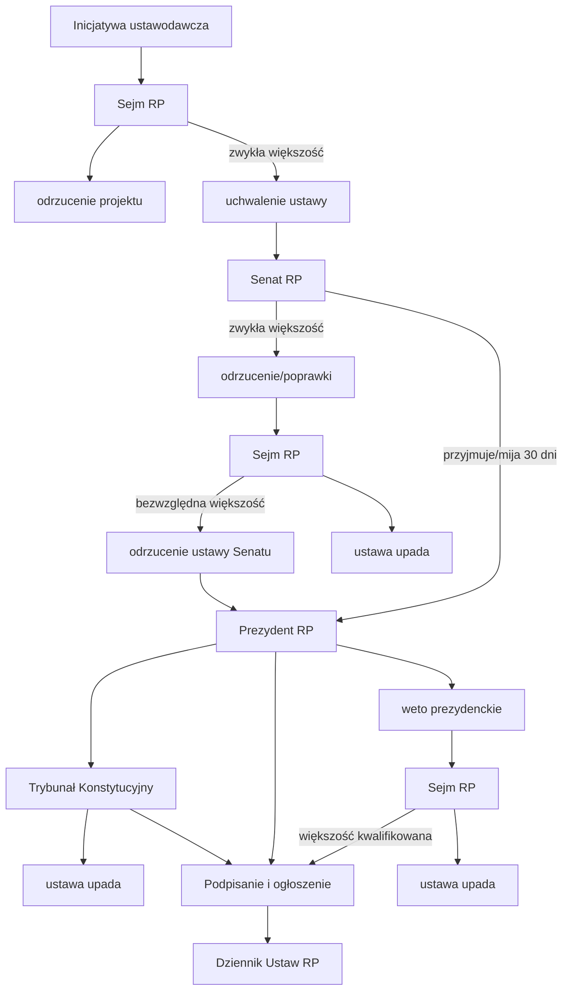

# Źródła prawa
## Ustanawianie prawa
Prawo ustanawia prawodawca, czyli państwo, w Polsce głównie parlament (ustawodawca).

W aktach inne organy mogą być upoważnione do wydawania szczegółowych regulacji w niektórych sprawach.

## Gdzie prawo obowiązuje
Prawo danego państwa obowiązuje na całym jego terytorium: 

- obszar lądowy, przestrzeń podziemną i powietrzną, morskie wody przybrzeżne

### Wyjątki
- rozszerzające
	- może obowiązywać poza terytorium na:
		- statkach morskich, powietrznych i kosmicznych, które podnoszą jego banderę
		- w jego placówkach dyplomatycznych i bazach wojskowych na terenie innego państwa
- ograniczające
	- tylko na częśći danego państwa jeśli:
		- zostały ustanowione przez organ władzy terenowej
		- są przeznaczone dla wydzielonej części terytorium

## Kogo obowiązuje
- Organy władzy państwowej ustanawiają **prawo powszechnie obowiązujące** oraz **prawo wewnętrznie obowiązujące** (prawo wewnętrzne)
- Obywatele poza granicą są zobowiązani do przestrzegania prawa państwa, w którym przebywają oraz swojego.
- Prawo krajowe nie obowiązuje przedstawicieli obcych rządów posiadający immunitet dyplomatyczny

- Akty prawa powszechnie obowiązującego
	- na całym terytorium RP
		- wiąże wszystkie podmioty na obszarze RP
	- miejscowo
		- ustanowiony przez upowniażniony organ władzy terenowej wiąże wszystkie osoby i inne podmioty znajdujące się w określonej części państwa
		- Rodzaje:
			- terenowej administracji rządowej
				- rozporządzenia wojewodów
			- samorządu teryterialnego
				- uchwały rad gmin, sejmików wojewódzkich
- Akty prawa wewnętrznego
	- akt ustanowiony przez dany organ władzy wiąże podległe mu jednostki administracji (np. funkcjonariuszy, uczniów szkoły)
	- Rodzaje:
		- Uchwały
			- akty organów kolegialnych
			- np. uchwała Sejmu RP w sprawie liczby wicemarszałków
		- Zarządzenia
			- akty organów jednoosobowych
			- np. zarządzenie prezydenta RP w sprawie mobilizacji sił zbrojnych
		- Inne
			- np. regulaminy, statuty

## Kiedy obowiązuje
#### Początek obowiązywania
Aby przepisy zaczęły obowiązywać, nie wystarczy, aby kompetentny organ uchwalił albo podpisał dany akt.

- Nowe regulacje muszą zostać **opublikowane** we właściwym dzienniku urzędowym.
- Od tej chwili stają się częścią prawa, jednak nie muszą wchodzić w życie od razu.

##### Vacatio legis
Okres, który może dzielić dzień publikacji od momentu wejścia w życie to **vacatio legis**.

- Czas, który prawodawca daje adresatom nowych norm na zapoznanie się z nimi.
- Akty normatywne powszechnie obowiązujące w Polsce wchodzą w życie po **14 dniach**

#### Koniec obowiązywania
W Polsce rzadko kiedy twórcy aktu prawnego wskazują koniec jego obowiązywania, najczęściej czas jest nieokreślony.

- Przepis przestaje zazwyczaj obowiązywać, gdy zostaje wprowadzony **nowy przepis** uchylający regulację.
- Uchylić dany przepis może także **Trybunał Konstytucyjny**, jeśli uzna go za niezgodny z Konstytucją RP albo ustawą
	- Regulacja traci moc prawną z chwilą ogłoszenia orzeczenia w tej sprawie
	- lub po czasie, który Trybunał wyznaczy
		- ustawy → nie dłużej niż 12 miesięcy
		- niższa ranga → nie dłużej niż 18 miesięcy

### Prawo nie działa wstecz
lex retro non agit → prawo nie działa wstecz

##### Wyjątki, kiedy działa
- Gdy nowe prawo polepsza sytuację adresatów
	- np. wyrównanie wynagrodzenia za miniony okres pracy
- Jeżeli są korzystniejsze dla sprawcy przestępstwa popełnionego przed ich wejściem w życie

## Dzienniki urzędowe
- Jedynymi oficjalnymi źródłami obowiązującego prawa są **teksty autentyczne** aktów, które znajdują się w dziennikach urzędowych (**publikatorach**).
- Inne opracowania ogłoszonych aktów nie mogą być podstawą do stwierdzenia właściwej treści przepisu.

## Hierarchia źródeł prawa
1. Konstytucja RP
2. Ustawa / Rozporządzenie z mocą ustawy
	1. rozp. z mocą ust. obowiązuje do posiedzenia sejmu
3. Ratyfikowana umowa międzynarodowa
	1. w przypadku ważnych sytuacji wymagana zgoda sejmu (duża ratyfikacja) → nad ustawą
	2. w przypadku nieważnych (mała ratyfikacja) → pod ustawą
4. Rozporządzenie
5. Akty prawa miejscowego

## Procedura ustawodawcza

### prosty schemat

